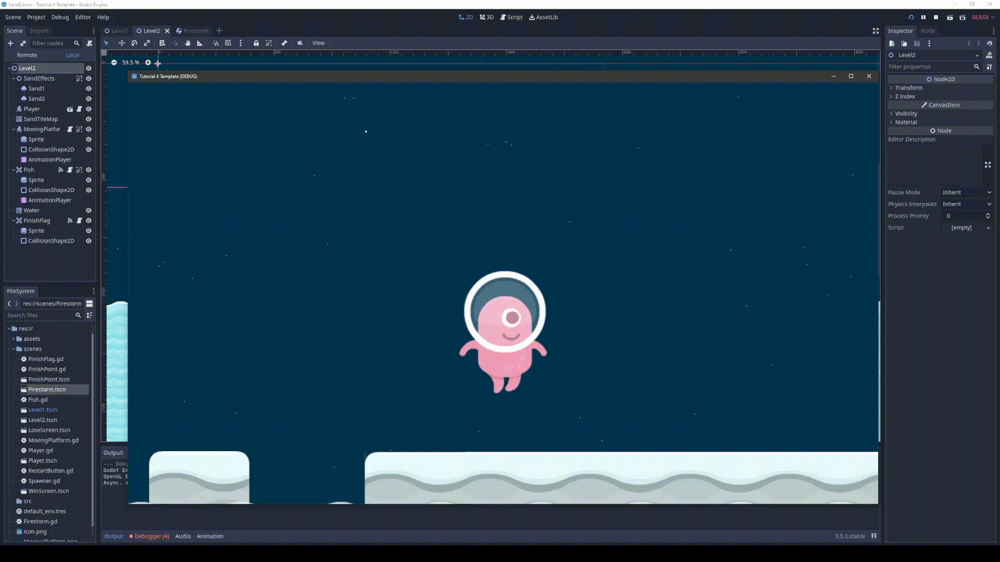

# Game Dev Tutorial 4

    <a href="https://github.com/sponsors/alexandresanlim">
        
            

                <h2>v3.5.3 LTS</h2>
            
  
    </a>

## 🗺️ Latihan Mandiri - Membuat Level Baru Dengan Tile Map & Obstacle Berbeda 🗺️

- ### Moving Platform

    > Level have proprietary moving platform.
    
    My new implementation for an obstacle is having moving platform that moves side to side complete with AnimationPlayer node and CollisionShape2D for player to be able to stand on top of it.

    

- ### " Fish Pool "

    > Implementing my random idea with moving platform and fish jumping around a pool. Kill player on hit.
    
    The FishEnemy is implemented complete with full ring around the nearby pool, making a loop between the animation of moving platform. We as player expected to fine the right timing to proceed.

    

- ### " Firestorm "

    > Spawner for a fire orb object that rains from the sky. Kill player on hit.
    
    Implemented complete with Spawner for each seconds and having a timer node for resource leak management.

    

##
## 🖮 Control & Keybinds 🖮

> As per usual, i decided to rebind the main control keys for our convenience.

- *W* = Jump, double tap it for double jump

- *A* = Move left

- *D* = Move right