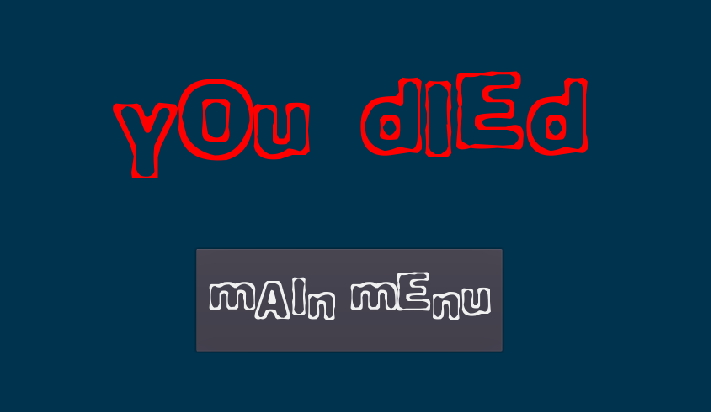
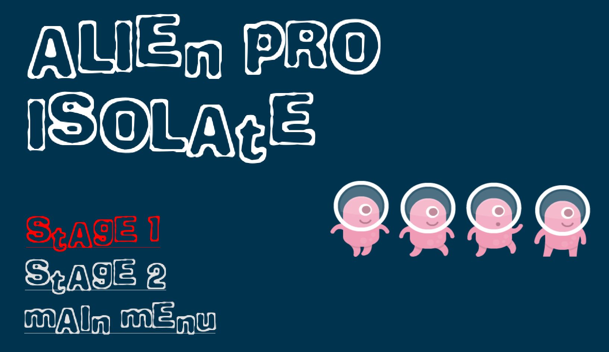

# Game Dev Tutorial 6

    <a href="https://github.com/sponsors/alexandresanlim">
        
            

                <h2>v3.5.3 LTS</h2>
            
  
    </a>

## 🗺️ Latihan Mandiri - Fitur Tambahan 🗺️

- ### Game Over : Back To Main Menu

    > Tombol pada layar game over untuk kembali ke menu utama.

    

- ### Select Stages

    > Select stages yang ada pada permainan.

    

- ### Transition Effect : Fade In & Out

    > Layar dan efek transisi antar level, dari level 1 ke level 2.

    

##
## 🖮 Control & Keybinds 🖮

> As per usual, i decided to rebind the main control keys for our convenience.

- *W* = Jump, double tap it for double jump

- *A* = Move left

- *D* = Move right